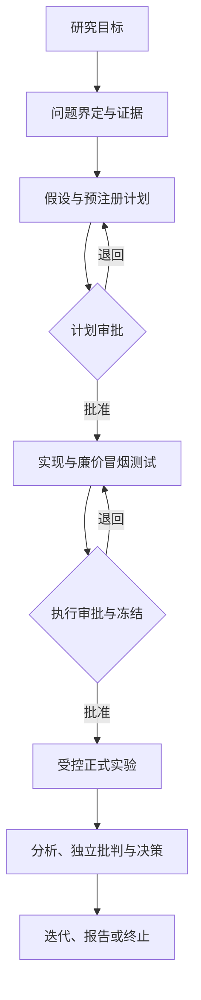

# OpenCode 科研模式 0.4.0-alpha.4

这是一个与“调研汇报模式”和“自主实现模式”分离的、目标驱动的计算科研工作流。OpenCode 负责模型与工具调用，Skills 提供阶段方法，`researchctl.py` 负责状态、审批、校验、恢复和安全边界。

长期目标、最终架构和 v0.4→v1.0 版本路线见 [`技术路线规划.md`](技术路线规划.md)。

## 为什么不是“给模型一组 Skills”

Skill 只回答“这一阶段应该怎样做”；Workflow 决定“什么时候调用哪个 Skill、产出什么、什么条件下才能继续”。可靠性来自四层分工：

| 层 | 职责 |
|---|---|
| Workflow | 固定阶段、转换、重试、审批门和终态 |
| Skills | 证据检索、假设生成、实验规划、统计分析等方法 |
| Agents | 将规划、实现、正式执行和独立审查隔离为不同权限 |
| Controller | 持久化状态、结构化校验、并发锁、冻结和预算保护 |



科研模式不以“生成一篇漂亮报告”为完成标准，而是输出可审计的 `SUPPORTED`、`REFUTED`、`INCONCLUSIVE`、`BLOCKED` 或 `TERMINATED` 结论。

## 当前可靠性边界

- 每个关键阶段同时生成面向人阅读的 Markdown 和面向控制器校验的 JSON。
- 计划审批发生在写代码之前；执行审批发生在正式消耗预算之前。
- 第二次批准会冻结脚本、配置、任务、专用 Agent 和执行器的 SHA-256；正式执行前后均复核。
- 正式阶段只能调用 `.research/runtime/guarded_runner.py`；Guard 校验冻结清单、执行授权和环境锁后才交给 `LocalExecutor`。
- `LocalExecutor` 按 manifest 中的 trial 顺序逐个调用单 trial 入口，持久化 attempt、日志、结果与原子 checkpoint；重启时跳过已完成 trial。
- 每个 trial 都有稳定 ID 和幂等键。死进程留下的有效结果会被收养；缺失结果才按批准的失败策略重试；活跃 PID 会阻止重复执行。
- Guard 按墙钟时间、会话数和成本主动终止，并在每个 trial 后重新核算预算。
- 环境锁记录实际 Python 解释器、运行时以及代码、依赖锁、数据文件的内容哈希；trial 强制复用通过审批的解释器，正式执行前后都要与授权一致。
- 同一项目只能有一个控制器进程；异常中断后的 `running` 状态会被记录并安全恢复。
- 阶段产物不仅检查存在性，还检查结构、任务覆盖、可证伪性、确定性 grader、预算一致性和决策枚举。
- 所有科研 JSON 都带版本化 Schema；控制器为阶段产物生成独立 provenance sidecar。
- 每个检索查询必须保存参数、结果数量、原始快照路径及 SHA-256，claim、evidence 和 hypothesis 使用稳定 ID 连接。
- Evidence、hypotheses 或 experiment-plan 首次结构校验失败时，控制器会保存无效产物并在临时隔离工作区启动一次有界恢复；完整错误列表、精确 Schema 和阶段策略会反馈给专用 Agent。
- Evidence 修复只能处理已声明的字段/枚举映射和缺失响应记录；实验计划修复只能处理 `task_id→id` 等无歧义结构映射。Hypotheses 中可由账本确定推出的 Claim ID 会按 ledger 顺序映射为 Evidence Record ID，其他科学内容保持逐字不变。
- 空证据引用、未知引用或科学内容缺陷不会被结构修复器“补齐”。它们进入无网络、无 Skills 的 `research-reviser`：只能依据冻结的 Evidence Ledger 删除或重写尚未批准的假设，不能新增假设，并必须提交逐假设 revision diff；任何伪造 Evidence ID、上游篡改、漏报修改或越界写入都会阻断。
- 实验计划校验一次聚合全部结构问题，强制 `tasks × conditions × repetitions ≤ max_sessions`，且计划预算只能收紧、不能突破 research contract，防止产生审批后无法执行或擅自扩大的计划。
- 阶段失败事件和 invalid 留档记录 `timeout`、`process_exit`、`missing_phase_result`、`invalid_phase_result`、`semantic_validation`、`boundary_violation` 或 `provenance_failure`；`.research/phase-result.json` 只是可覆盖的控制器邮箱，禁止进入 provenance 图。
- `researchctl audit <project>` 会检查语义、Skill 锁、产物哈希和上游依赖；上游变化会阻止审批或继续运行。

这仍不是容器级沙箱，也不能撤回已经发出的单次 API 请求。框架只能保证自身状态和已落盘结果不重复；若 trial 会调用外部计费 API、写数据库或提交作业，入口仍须把框架提供的幂等键传给外部系统。当前只实现串行 `LocalExecutor`，远程 SSH/Slurm 尚未开放。

## 安装与检查

```bash
mkdir -p ~/agent-workspace
cp -a research-mode-v0 ~/agent-workspace/research-mode-v04-alpha
cd ~/agent-workspace/research-mode-v04-alpha
```

如果当前 Shell 仍继承了旧 `exbody` 动态库路径，先执行 `unset LD_LIBRARY_PATH`。随后运行不会调用模型 API 的离线检查：

```bash
python3 researchctl.py doctor
tests/run_all.sh
```

## 建立并运行研究项目

新建项目；`--model` 可省略，省略时使用 OpenCode 当前选择的模型：

```bash
python3 researchctl.py new deepseek-benchmark-v04a \
  --goal "系统比较 DeepSeek V4 Pro 与 V4 Flash 作为 OpenCode 主模型时，在科研代码任务上的质量、速度和成本"
```

自动完成问题界定、证据、假设和实验计划，然后停在第一道审批门：

```bash
python3 researchctl.py run deepseek-benchmark-v04a
python3 researchctl.py status deepseek-benchmark-v04a
python3 researchctl.py audit deepseek-benchmark-v04a
less projects/deepseek-benchmark-v04a/research/experiment-plan.md
```

批准计划并运行实现与冒烟测试：

```bash
python3 researchctl.py approve deepseek-benchmark-v04a \
  --note "批准研究设计、停止条件和预算上限"
python3 researchctl.py run deepseek-benchmark-v04a
```

此时必须再次审阅任务、grader、准确会话数、预计成本和 smoke 结果。第二次批准会冻结可执行输入：

```bash
less projects/deepseek-benchmark-v04a/runs/smoke-test/report.md
python3 researchctl.py approve deepseek-benchmark-v04a \
  --note "批准冻结后的执行清单与预计成本"
python3 researchctl.py run deepseek-benchmark-v04a
```

拒绝当前方案可使用：

```bash
python3 researchctl.py reject deepseek-benchmark-v04a \
  --note "任务覆盖不足，请补充真实科研调试任务"
```

中断或重启后重复 `run` 即可恢复。不要并行运行同一项目。

## 实验计划最低要求

控制器要求至少两个比较条件、四个任务和三个任务类别，并要求主要指标与确定性 grader。对于科研代码模型比较，建议覆盖：论文/公式实现、Bug 修复、数据或训练管线、可复现性、性能优化、代码审查。隐藏测试用于降低针对样例硬编码的风险。

小任务集只适合工程试运行。正式结论应优先报告逐任务配对差异、效应大小、不确定性、失败类型与成本—质量权衡，不要仅凭小样本显著性检验宣称模型优劣。

## 权限与数据安全

- `research-worker`：做规划、证据、分析和写作；不开放远程执行或包安装。
- `research-builder`：仅实现已批准实验和 cheap smoke test；不能启动正式测量。
- `research-executor`：不可改冻结输入，只能调用受控执行器并写正式结果。
- `research-critic`：独立审查，不修改实验产物。
- `research-repairer`：只做可证明等价的结构规范化，无网络、无 Skills。
- `research-reviser`：只基于冻结证据修订未批准假设，无网络、无 Skills，所有变化必须留 diff。

不要把 API Key、SSH 私钥、个人数据或不可替代数据放进项目目录。以普通用户运行 OpenCode；不要给它 `sudo`。学校服务器和 Slurm 接入应在后续版本通过独立 adapter、命令白名单和额外审批门实现。

## 项目结构

```text
research-mode/
├── VERSION
├── 技术路线规划.md
├── researchctl.py
├── runtime/
│   ├── executor.py
│   ├── local_executor.py
│   └── guarded_runner.py
├── workflow/research-workflow.json
├── schemas/schema-registry.json
├── schemas/*.schema.json
├── skills.lock.json
├── .opencode/agents/
├── .agents/skills/
├── tests/
└── projects/<research-id>/
    ├── RESEARCH_GOAL.md
    ├── STATUS.md
    ├── configs/execution-manifest.json
    ├── .research/state.json
    ├── .research/frozen-manifest.json
    ├── .research/environment-lock.json
    ├── .research/execution-authorization.json
    ├── research/
    ├── scripts/
    ├── runs/
    ├── results/
    └── report/
```

## Skills 来源

项目固定引用 K-Dense Scientific Agent Skills v2.66.0（commit `1e5eeffbdad3749125afe7ab48a39694e27f181c`）中的八项能力：`scientific-brainstorming`、`hypothesis-generation`、`scientific-critical-thinking`、`statistical-analysis`、`scientific-writing`、`paper-lookup`、`experimental-design` 和 `peer-review`。完整目录树由 `skills.lock.json` 的 SHA-256 锁定；许可证与归属见 `THIRD_PARTY.md` 和 `LICENSE-K-DENSE.md`。

默认科研 Workflow 只在 evidence 阶段调用 `paper-lookup`，在 experiment-plan 阶段调用 `experimental-design`。`peer-review` 已准入但不会自动装进内部 critique：正式同行评审必须另走授权、保密、冲突、目标期刊政策和人工责任入口。创建项目时，控制器会把 `paper-lookup` 的四个已审查解析器复制到项目内 `.research/runtime/paper-lookup/`，避免越过项目目录执行外部脚本。

`experimental-design` 的方法论无需附加依赖；其随机化脚本需要 NumPy/Pandas，DOE 矩阵生成还需要 `pyDOE3`。系统不会自行安装缺失包，若计划确实需要生成 DOE 矩阵，应在人工批准的环境准备步骤中固定依赖版本。

你的全局 `personal-research-planning`、`personal-experiment-runner`、`personal-experiment-diagnosis` 也会在对应阶段被调用，但完整流程始终由 Workflow 和 Controller 控制。

## 版本升级

旧项目不能原地续跑新版本，因为状态、Schema 与 provenance 契约已经改变。保留旧项目作为审计记录，在新版本下创建项目，并只复制研究目标、人工约束和已验证事实。详见 `MIGRATION.md`。

v0.4.0-alpha.4 回应 alpha.3 真实 Canary 的 hypotheses 引用失败：补全 Hypothesis ABI 与聚合校验，区分确定性引用修复和受冻结证据约束的科学修订，并把失败类别与易变 phase-result 邮箱从长期 provenance 中分离。下一步在全新 Canary 中验证 hypotheses 能首过、确定性修复或有界修订，并继续触发 alpha.3 已实现的 experiment-plan repair，最终稳定停在 `plan-approval`；仍不开放远程执行。
