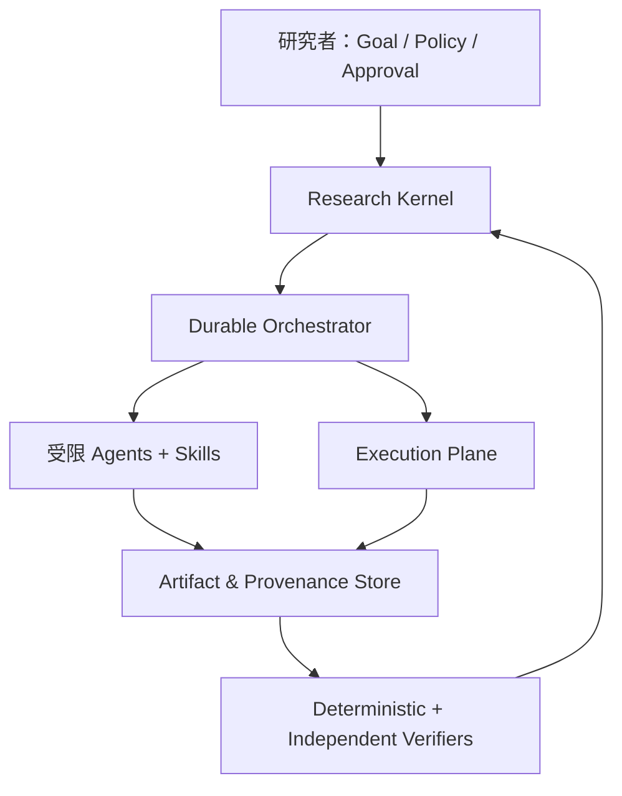
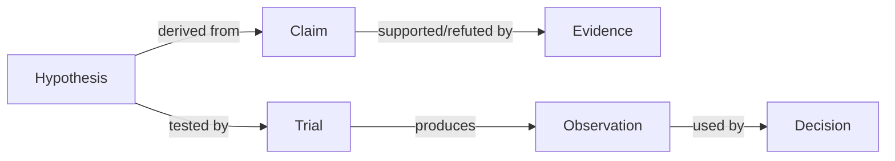

# OpenCode 自动科研系统技术路线规划

> 文档状态：2026-09-09；当前工程版本：v0.4.0-alpha.4。本文只规划“科研模式”，不与任务调研汇报模式、自主实现模式混合。

## 1. 总体判断

最终目标不是“给 OpenCode 装很多 Skills，让一个 Agent 从 Idea 一路写到论文”，而是建立一个**人类治理、证据驱动、可复现、可分支探索、可长期恢复的自动科研操作系统**：

- 用户给出研究目标、约束和预算；系统能自主推进到真正需要科学判断或高成本授权的节点。
- 每个主张能追溯到来源或实验，每个实验能追溯到代码、数据、环境、配置和批准记录。
- 探索性研究允许并行产生候选方向，但确认性结论必须来自冻结后的预注册实验。
- Agent 可以提出、实现、运行、诊断和迭代；验证器、批判者和人类拥有否决权。
- Harness、模型、检索源、实验后端和 Skills 都可替换，项目状态与科研资产不绑定 OpenCode。

一句话定义：

> **Workflow 是科研宪法，Artifact Contract 是事实接口，Skill 是可替换的方法模块，Agent 是受限执行者，Runtime 是可恢复的调度系统，Verifier 决定是否允许结论成立。**

## 2. v0.2 已经证明了什么

真实 `deepseek-benchmark` 试运行证明，OpenCode + DeepSeek 能自动连续完成 framing、evidence、hypotheses、experiment-plan，并正确停在审批门；v0.2 离线测试进一步通过了双审批门、结构化语义校验、预算拒批、输入冻结、篡改阻断、并发锁、中断恢复和 Guard 终止。

这说明当前路线的基础判断成立：**LLM 负责开放性科研工作，确定性控制器负责流程合法性。** 但它还只是可靠的线性科研流水线，不是成熟的自动科研系统。

| 已具备 | 仍然缺失 |
|---|---|
| 固定阶段和双人工审批 | 可验证、可复跑的学术检索管线 |
| Markdown + JSON 产物 | 统一的 claim–evidence–experiment 图谱 |
| Agent 权限隔离 | 数据、环境、Prompt、Skill 的完整 lineage |
| 正式执行输入冻结 | 本地/Slurm/云端执行适配器与资源租约 |
| 成本、会话、时间 Guard | 多假设分支搜索与预算分配 |
| 单项目锁和恢复 | 独立复现、盲审与跨模型验证 |
| 模型任务覆盖下限 | 多项目队列、长期调度、通知和观测面板 |

## 3. 外部进展带来的设计结论

截至 2026-09，值得吸收的不是某个项目的完整代码，而是以下经过实践验证的结构：

| 进展 | 对本项目的启示 |
|---|---|
| [Agent Skills 开放规范](https://agentskills.io/home)采用 catalog → activation → resources 的渐进加载 | Skill 必须保持小而专一、可版本化；完整 Workflow 不能塞进一个巨型 SKILL.md |
| [Scientific Agent Skills v2.66.0](https://github.com/K-Dense-AI/scientific-agent-skills/releases)已有约 165 个 Skills，并开始为依赖、环境变量和测试建立规范 | 建立 Skill 注册表和准入测试，按项目选装，不复制全部技能到上下文 |
| [Paper Lookup](https://github.com/K-Dense-AI/scientific-agent-skills/blob/main/skills/paper-lookup/SKILL.md)提供 11 个学术 API、可复现查询参数和标识符 | v0.3 优先用它替换自由网页搜索，先做可回放检索，再做大规模综述 |
| [Experimental Design](https://github.com/K-Dense-AI/scientific-agent-skills/blob/main/skills/experimental-design/SKILL.md)强调随机化、正确复制层级、区组和避免伪重复 | 实验计划 Validator 应从“字段齐全”升级为设计有效性规则 |
| [AI Scientist-v2](https://github.com/SakanaAI/AI-Scientist-v2)采用 Experiment Manager + progressive tree search，但官方也指出开放探索成功率低于强模板路线 | 先保留稳定线性主干，再增加有预算的候选分支；不能直接把全流程改成自由树搜索 |
| [Google AI co-scientist](https://arxiv.org/abs/2502.18864)通过生成、批判、排名和演化的异步多 Agent tournament 改进假设 | 多 Agent 最适合“产生候选与相互攻击”，不适合多人共同修改同一代码目录 |
| [PaperBench](https://openai.com/index/paperbench/)用层级 Rubric 将论文复现拆成 8,000 余个可评分检查点 | 最终评价应由分层 Rubric、隐藏检查和部分得分组成，不能靠 Agent 自报完成 |
| [CORE-Bench](https://arxiv.org/abs/2409.11363)早期最强基线在困难复现任务上仅约 21% | “先能可靠复现，再宣称自主发现”应成为项目硬原则 |
| [CORE-Bench v1.1/OOD 分析](https://arxiv.org/html/2606.26158v1)显示能力提升后还会暴露 benchmark 构念效度与污染问题 | 必须保留 OOD/隐藏任务、任务版本和污染审计，不能只追求固定 benchmark 分数 |
| [Agentic AI Scientists Are Not Built For Autonomous Research](https://arxiv.org/html/2605.08956v1)警告大规模自动循环可能放大选择性报告和事后假设 | 系统必须区分 exploration 与 confirmation，保存失败分支并禁止悄悄改主指标 |
| [LangGraph](https://docs.langchain.com/oss/python/langgraph/overview)把 deterministic nodes、durable execution、persistence、HITL 作为运行时能力 | 当单机 JSON 状态机不足时，可替换 Orchestrator；科研对象模型不应依赖 LangGraph |
| [DeepSeek Harness](https://github.com/deepseek-ai/deepseek-harness)提供 Everything-is-a-plugin 与事件化 session，但仍是 developer preview | 作为未来 Runtime Adapter 和架构参考，不作为当前唯一内核 |
| [MLflow Dataset Tracking](https://mlflow.org/docs/latest/ml/dataset/)提供数据版本、实验和模型 lineage | 后续通过可选 Adapter 接入，核心仍保留供应商无关的 manifest 与内容哈希 |

由此得到三条路线原则：

1. **先可靠、后自治**：先实现证据、复现和验证，再扩大搜索空间和运行时长。
2. **先单写、多审，后多写**：候选生成可并行，代码与正式结论必须有明确单一所有者和独立审查者。
3. **核心自持、外围复用**：科研状态、对象契约、审批和审计由本项目控制；Skill、Harness、检索、MLflow、Slurm 都通过适配器接入。

## 4. 最终系统架构



### 4.1 Research Kernel：科研语义内核

它不负责调用模型，而是定义系统中什么算“事实”和“合法状态”。核心对象包括：

| 对象 | 必须记录的内容 |
|---|---|
| `ResearchSpec` | 问题、范围、排除项、预算、风险、停止条件、人工权限 |
| `EvidenceRecord` | claim、来源标识符、查询、访问时间、原文证据、支持/反驳、验证状态 |
| `Hypothesis` | H0/H1、竞争解释、可判别预测、反证条件、证据依赖 |
| `ExperimentPlan` | 变量、任务/数据、随机化、复制层级、指标、grader、功效、预算 |
| `Trial` | 冻结输入、环境、代码 commit、数据哈希、seed、资源、原始输出 |
| `Observation` | 原始值、缺失、失败、异常、质量标记；不可只保存汇总均值 |
| `Analysis` | 预注册分析、效应量、不确定性、敏感性分析、偏离说明 |
| `Review` | 审查者身份/模型、盲审输入、问题、严重度、是否解决 |
| `Decision` | 支持/反驳/不确定/阻塞/终止，以及逐条证据链 |

这些对象使用版本化 JSON Schema，并拥有稳定 ID。Markdown 只是它们的人类可读视图；系统状态不得再依赖模型自由文本。

### 4.2 Evidence Graph：证据图而非文献列表

最终存储关系应为：



同一来源可以支持一个 claim、反驳另一个 claim；“找到论文”不等于“验证主张”。检索必须保存数据库、完整查询、筛选规则、DOI/PMID/arXiv ID、版本和访问日期。PDF 摘要、搜索 snippet 和模型记忆不能直接成为 `verified` 证据。

### 4.3 Hypothesis & Experiment Manager：受预算约束的分支搜索

线性主干保留，但在假设与探索实验之间允许建立 DAG：

- Generator 产生多个候选假设；Critic 找反例和混杂；Ranker 按新颖性、可证伪性、影响和成本排名。
- 每个分支先获得很小的探索预算；只有通过明确 promotion rule 才能进入更昂贵实验。
- 分支共享只读基线和数据快照，使用独立 Git worktree/容器/输出目录，禁止多个 Agent 同写一个工作区。
- 探索结果只能生成新假设，不能冒充确认性证据；进入 confirmation 前必须重新预注册并冻结。
- 所有失败、负结果、被淘汰方向和选择依据进入 ledger，防止只汇报成功分支。

### 4.4 Execution Plane：本地、Slurm 与云端统一接口

定义统一 `Executor` 接口，而不是把 `ssh`/`sbatch` 写进 Skill：

```text
prepare(spec) -> execution_id
submit(execution_id) -> external_job_id
poll(execution_id) -> status + usage
collect(execution_id) -> artifact_manifest
cancel(execution_id, reason)
```

首批后端为 `LocalExecutor` 和 `SlurmExecutor`。每个执行使用：

- 固定 Git commit、conda-lock/uv.lock 或 OCI image digest；
- 数据集 URI + checksum + license；
- seed、硬件、CUDA/驱动、环境变量白名单；
- GPU 时长、墙钟时间、磁盘、API 成本和重试配额；
- 心跳、checkpoint、幂等 job key 和资源 lease；
- 原始 stdout/stderr、指标、checkpoint 和失败原因。

学校集群接入必须走专用 Slurm Adapter：只允许预定义登录节点、项目目录、分区和命令模板；提交、取消、高 GPU 预算分别设审批策略。Agent 不直接获得通用 SSH Shell。

### 4.5 Verification & Governance：系统的核心竞争力

最终至少有四层验证：

1. **Schema Validator**：类型、枚举、引用完整性和版本兼容。
2. **Deterministic Validator**：单元测试、隐藏测试、统计规则、哈希、预算、环境和结果重算。
3. **Independent Reviewer**：使用不同上下文，最好可切换不同模型；不能看到作者的自我评价和非必要推理。
4. **Reproducer**：从冻结 manifest 在干净环境重新执行关键结果，比较容差并生成 reproduction report。

人类审批不是固定地“每阶段询问”，而是 Policy Engine 根据风险触发：

- 必须审批：研究契约、确认性实验冻结、预算提升、外部写操作、结论发布。
- 条件审批：新增依赖、改变主要指标/数据、扩大 GPU 规模、重复失败后的策略变化。
- 可自动：只读检索、小预算 sandbox、确定性检查、已批准范围内的重试和日志分析。

### 4.6 Durable Orchestrator：可恢复而非一直在线

长期任务需要事件存储、checkpoint、幂等、租约、超时、重试和补偿动作。Orchestrator 只调度科研对象，不把科学逻辑写死在框架 API 中。

短期继续使用当前 Python Controller + append-only events + atomic JSON；v0.4 alpha 已将 trial checkpoint 独立为原子 `executor-state.json` 并引入 `Executor` 接口。达到多项目、并行分支或多 Worker 需求后，再把状态迁往 SQLite/PostgreSQL，并评估 LangGraph、DeepSeek Harness 或自研队列后端。迁移条件是统一的 `StateStore`、`EventStore`、`Scheduler`、`Executor` 接口已经稳定，而不是因为某个框架流行。

## 5. Skill 体系：Workflow 配 Skills，但不是一一硬编码

### 5.1 四层 Skill 结构

| 层级 | 内容 | 策略 |
|---|---|---|
| S0 基础能力 | paper lookup、PDF/表格、Git、统计计算 | 少量、稳定、严格测试 |
| S1 科研方法 | brainstorming、hypothesis、experimental design、critical thinking、peer review | Workflow 按阶段选择 |
| S2 领域能力 | CV、机器人、声学、嵌入式、生物信息等 | 每项目显式启用 |
| S3 个人方法 | 你的研究规划、实验运行、失败诊断、论文风格 | 长期迭代的核心资产 |

### 5.2 Skill 准入与锁定

不是发现一个成熟 Skill 就直接加入。每个 Skill 先经过：

1. 来源、许可证、维护状态和版本审查；
2. 权限、网络目标、环境变量、安装命令和数据外发审计；
3. trigger/negative-trigger 测试，防止错误自动调用；
4. 输出能否映射到本项目 Schema；
5. fixture 回归和失败模式测试；
6. 固定 commit/tag、文件哈希和依赖；写入 `skills.lock.json`；
7. 升级先在兼容矩阵测试，通过后再进入下一工程版本。

不要一次引入 K-Dense 全库。v0.3 推荐：

- 保留原有五个已固定 Skills，并将三项新增 Skill 作为独立准入批次锁定；
- P0 引入 `paper-lookup`，因为它无需凭证即可访问多种学术 API，并强调可复现查询；
- P0 引入 `experimental-design`，强化随机化、复制层级和伪重复检查；
- P0 评估 `peer-review`，用于结构化独立审查而非代替实验验证；
- `literature-review` 只在系统综述型项目启用，它的依赖和强制图示要求不适合作为所有 evidence 阶段的默认能力；
- `research-lookup` 作为配置了 Parallel API 后的可选大规模检索后端；
- 领域 Skills 由项目 profile 按需加载，默认关闭安装和外部写权限。

## 6. 版本路线

### v0.2：线性可靠闭环（已完成）

目标：证明一条 goal 能自动推进、在关键门停下、失败可阻断、输入可冻结、预算可限制。

### v0.3：证据与可复现内核（已完成）

当前进展：v0.3 已完成 Schema Registry、可回放 evidence snapshot、稳定 ID、controller provenance、Skill lock、依赖失效和 `researchctl audit`。从 K-Dense v2.66.0 官方归档准入并锁定 `paper-lookup` 2.1、`experimental-design` 1.2、`peer-review` 2.2；前两者分别进入 evidence 与 experiment-plan，`peer-review` 因强制授权和保密 intake 不与内部 critique 混用。

实现：

- 全部科研对象拆为独立版本化 JSON Schema；
- 项目内 `paper-lookup` 已审查运行工具、查询快照、来源身份去重与 claim binding；
- `skills.lock.json`、Skill 准入清单与 trigger 回归测试；
- 全局 provenance envelope：生成模型、Agent、Prompt hash、Skill hash、输入/输出哈希；
- 改进 experimental-design Validator：复制层级、seed、数据划分、泄漏、主要/次要指标；
- `researchctl audit`，一次输出断链证据、未冻结输入和不可复现项。

验收：给定相同检索快照可重建 evidence ledger；任一结论可自动追到来源或 trial；篡改任一上游对象会使下游失效；无网络 fixture 可完成全回归。

### v0.4：可复现实验运行时（alpha.2）

alpha.1 已实现：

- `Executor` 抽象与串行 `LocalExecutor`，由框架拥有 trial 排序、重试、checkpoint 和汇总；
- 严格 execution manifest 与单 trial 入口 ABI，每个 trial 具有稳定 ID 和幂等键；
- 原子 executor state、进程锁、attempt 历史、失败分类、已完成 trial 跳过和死进程恢复；
- Python、依赖锁、代码、数据与配置哈希组成的 environment lock，并与执行授权、冻结清单和预算绑定；
- trial/result/checkpoint Schema，以及超时、退出、无效结果、篡改、孤儿结果收养和端到端回归测试。

alpha.1 的边界：只有单机串行执行；未提供容器级 clean-room、资源 lease、Slurm 或跨外部系统的 exactly-once。框架幂等键只能防止自身重复调度，外部计费 API、数据库或作业系统也必须接受或记录该键，才能避免不可逆副作用重复发生。

真实 `fp-summation-canary-v04a` 进一步发现：DeepSeek 能完成高质量检索，但会把 `text` 写成 `statement`、把受控枚举写成自由语义标签，并为失败请求留下 `snapshot: null`。alpha.2 因此增加 Evidence Schema Repair：Validator 一次聚合全部错误；首次无效产物留档；第二次尝试切换到禁网、禁 Skills 的修复 Agent并在临时隔离工作区执行；修复前后锁定科学内容、来源身份、已有快照和允许写入路径，仅通过验证的白名单文件原子回写。结构修复不获得重新检索或重写科学判断的权力。

v0.4 后续实现资源 lease、执行事件和受限 `SlurmExecutor`。验收保持为：在干净目录依据 manifest 一条命令复跑；断电/断网后不重复已完成 trial；重复提交使用相同幂等键；超预算可终止并保留完整失败记录。

### v0.5：多假设分支与 Experiment Manager

实现 hypothesis DAG、候选 tournament、Git worktree 隔离、小预算探索、promotion/pruning、分支级预算与停止规则。

验收：多个分支不会互相改文件；预算按策略分配；失败分支不丢失；探索结果未经重新预注册不能进入确认性结论。

### v0.6：独立验证与科研完整性

实现层级 Rubric、盲化 Reviewer、不同模型交叉审查、clean-room Reproducer、结果重算、偏离与选择性报告审计、OOD/污染检查。

验收：故意注入错误引用、数据泄漏、事后换指标、硬编码 grader、选择性删除失败实验时，系统必须阻止 `SUPPORTED` 和正式报告发布。

### v0.7：长期运行与多项目运维

实现 SQLite/PostgreSQL EventStore、任务队列、Worker lease、周期调度、优先级、通知、运行面板和人工恢复界面；此阶段再决定是否采用 LangGraph/DeepSeek Harness 作为 Orchestrator 后端。

验收：并行项目、跨日暂停、进程崩溃和 Worker 迁移不破坏状态；每次外部副作用可审计且至多执行一次。

### v0.8：领域包与科研记忆

建立 CV/机器人/具身智能等 Domain Pack，以及你的 S3 方法库。记忆只保存已验证事实、失败模式、决策理由和可复用模板，不把模型自由总结当事实。

验收：新项目可复用既有方法但不会把旧项目结论错误迁移；每条长期记忆都带来源、适用范围、版本和失效条件。

### v1.0：人类治理的自主科研系统

达到以下条件才称为 v1.0：

- 从 goal 到证据、假设、实现、实验、分析、复现、审查和报告形成完整 provenance graph；
- 在批准的成本、数据和执行边界内可跨日自主运行；
- 支持多个候选方向，但严格隔离探索与确认；
- 关键结果可在干净环境复跑，并经过独立 Reviewer/Reproducer；
- Harness、模型、Skill 和执行后端至少各有两个可替换实现或通过兼容测试；
- 在项目自带 benchmark 上同时报告成功率、复现率、引用有效率、成本、人工介入次数和科学完整性违规拦截率。

## 7. 暂时不做的事情

- 不以“自动生成完整论文”作为近期主指标；报告是证据链的视图，不是系统目标。
- 不现在重写成十几个自由聊天的 Agent，也不让多个 Agent 共享写权限。
- 不让 Skill 自己决定流程跳转、预算增加或结论成立。
- 不把 OpenCode session 当作长期记忆或唯一状态源。
- 不把大量第三方 Skills 全局安装后默认授权。
- 不在缺少 clean-room reproduction 前开放完全无人审批的高成本正式实验。
- 不直接给 Agent 通用 SSH、Slurm、`sudo`、包安装或任意外部目录权限。

## 8. 项目级评价指标

| 维度 | 指标示例 |
|---|---|
| 科学有效性 | 可证伪假设率、预注册遵守率、泄漏/伪重复拦截率 |
| 证据质量 | DOI/ID 有效率、claim binding 完整率、原始来源复核率、撤稿/版本检查率 |
| 可复现性 | clean-room 复跑成功率、结果容差通过率、完整 lineage 比例 |
| Agent 能力 | 阶段一次通过率、隐藏 Rubric 得分、失败诊断正确率、恢复成功率 |
| 自主程度 | 无需干预的有效阶段数、每项目人工介入次数、错误升级率 |
| 成本效率 | 每个有效假设/确认结果成本、无效调用率、GPU 利用率 |
| 安全治理 | 越权拦截率、预算超限次数、重复副作用次数、审计事件完整率 |

自主程度不能单独优化。如果人工介入减少但复现率或科学有效性下降，版本应判定为退化。

## 9. 下一步工程决策

当前处于 **v0.4.0-alpha.4“本地可恢复执行内核 + 分层阶段恢复”**。alpha.3 的真实 Canary 证明 evidence 可通过，但 hypotheses 出现两类本质不同的失败：Claim ID 混入 Evidence ID 是可证明等价的引用错误，空 `evidence_ids` 则是科学支持不足。alpha.4 因此不再把所有错误都交给同一种 repair，而是建立“结构修复 / 受证据约束修订 / 诚实阻塞”三分法。暂不扩展树搜索。下一步按证据推进：

1. 保留 `fp-summation-canary-a2` 与 `fp-summation-canary-a3` 的 blocked 状态作为真实失败夹具，不人工复位或修改产物；
2. 在 alpha.4 新建同目标 Canary，预算至少满足 4 tasks × 2 conditions × repetitions；验证 hypotheses 首过，或只发生确定性 Claim→Evidence 修复，或发生一次有完整 diff 的 grounded revision；
3. 继续运行到 experiment-plan，验证 alpha.3 的计划修复能在真实模型上首过或只做无歧义修复，并稳定停在 `plan-approval`；
4. 审阅 invalid/revision 留档、聚合错误、repair/revision provenance、上游不可变性、实验设计指纹和预算一致性，确认没有证据伪造或语义漂移，再进入 implementation；
5. 在 trial 的三个边界注入真实故障：入口启动前、外部调用后但结果落盘前、checkpoint 落盘后，核对幂等键和费用账本；
6. 增加 append-only execution events、资源 lease/heartbeat 与取消语义，避免只依赖 PID 判断；
7. 增加可选的固定依赖环境（优先 lockfile，随后 OCI digest）和 clean-directory reproducer；
8. 本地故障注入和真实小预算 canary 都通过后，再实现仅允许 `sbatch/squeue/sacct/scancel` 模板的 Slurm Adapter；
9. 为远程提交、预算提升、终止作业和新依赖增加独立审批策略，再在学校集群运行单作业 canary；
10. v0.4 的本地与 Slurm 验收完成后，才进入 v0.5 多假设 DAG。

这条路线避免两个极端：既不把系统停留在“手动发一句命令调用一个 Skill”，也不在基础验证不足时直接追求无人值守 AI Scientist。最终的自主性来自**可验证的状态推进和受约束的分支搜索**，而不是更长的 Prompt 或更多 Agent。
